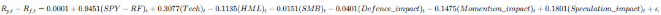

# Risk Attribution of Personal Portfolio

Hi everyone, I am Kai, an aspiring Risk Quant and a Current Data Scientist. As a young investor who took aggressive positions in my early investing years, I wanted to take a rigorous, quantitative look at my personal stock portfolio. This project applies institutional-grade risk frameworks to answer four key questions:

- What Factors can best explain my Portfolio's Systematic Risk
- What is the Expected Shortfall or basically the doomsday scenario 
- How much will be my Drawdown if Stress Scenarios were to be applied
- What should I do to Hedge/reduce the amount of losses 

Project Overview:

The portfolio universe and stock weights are defined in the config file. All analysis is conducted over a 5-year horizon.

Methodology:

1) Monte Carlo Simulation (Covariance based)

Simulates portfolio returns using the covariance structure of historical returns to estimate Value at Risk (VaR) and Conditional VaR (CVaR)

2) Factor Risk Attribution

The factor model explains 85.7% of total portfolio risk — confirming a high degree of systematic exposure.

Key finding: The portfolio closely resembles the broad market, with a notable tilt towards Technology and Speculative factors.

3) PCA - idiosyncratic risk 

Isolate and Quantify Unsystematic Risk in Portfolio:

Top 3 Stocks with Highest Unsystematic Risk: PLTR, DKNG & SOFI 

4) Factor Based Monte Carlo Simulations

This approach is more realistic than Method 1 — factors co-move during market dislocations, meaning all portfolio holdings react coherently to the same macro shocks. This captures tail risk more accurately (VaR & CVaR)

5) Stress Testing - 

Given the portfolio's heavy exposure to Market, Tech, and Speculation factors, three historically-grounded stress scenarios are simulated using past factor data:
- Tech Sell off : 2022
- Covid Crash : 2021
- Speculation burst: 2021-2022

6) Hedging Strategies/ Diversification 

Factor exposures directly inform two risk reduction strategies — hedging and diversification.

Hedging: Rile of thumb is if we have a market beta of 0.94, we will short the Market by 94% of the Portfolio Value (Full hedge)
Diversification: Pick stocks with 0 or negatively Correlation to the Beta Factors. We reduce Beta to a target beta by buying the difference of [(Beta-Target Beta) x Portfolio Value / Target Stock Price] -> This will reduce the magnitude of beta, which overall can lead to lower drawdown

# Project Structure:

Quant-Risk-Project/
├───additional data/
│   └───F-F_Research_Data_Factors_daily.csv
├───config.yaml
├───helpers.py
├───monte carlo simulation.ipynb
├───README.md
├───requirements.txt
└───__pycache__/
    └───helpers.cpython-311.pyc